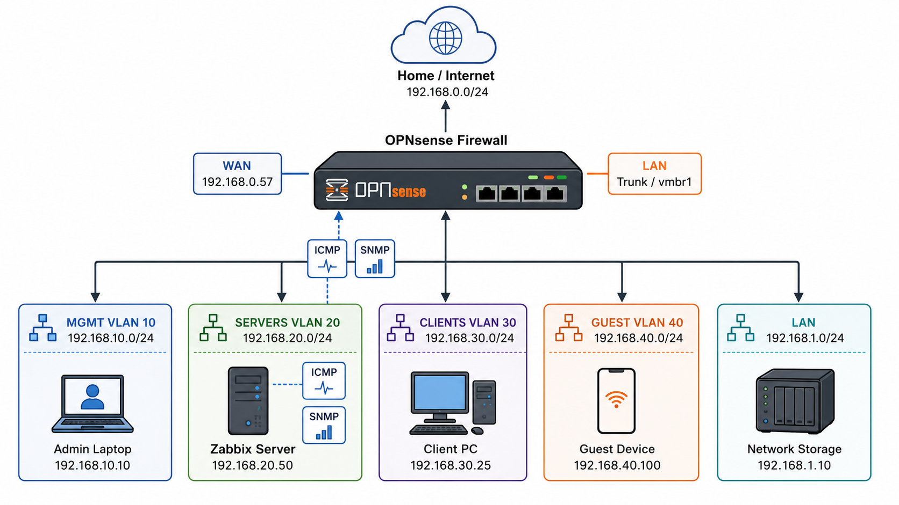

# OPNsense Firewall Monitoring Network Design - HomeLab



## Purpose

This note explains the network design used to monitor OPNsense from Zabbix, including:

- OPNsense firewall interfaces
- LAN/VLAN separation
- SERVERS network design
- why Zabbix was moved into the SERVERS network
- why a static IP was added to `ens19`
- how ICMP and SNMP monitoring fit into an enterprise-style firewall monitoring setup

---

## Final Design Summary

```text
                    Home / External Network
                         192.168.0.0/24
                                |
                              WAN
                         OPNsense Firewall
                                |
      -----------------------------------------------------
      |             |              |           |           |
    MGMT         SERVERS        CLIENTS      GUEST        LAN
192.168.10.1   192.168.20.1   192.168.30.1 192.168.40.1 192.168.1.1
                  |
                  |
             Zabbix Server
             192.168.20.50
```

The key design decision:

> Zabbix should monitor OPNsense from the SERVERS network, not from the WAN side and not from the CLIENTS network.

---

## OPNsense Interface Layout

The OPNsense firewall has multiple interfaces or VLAN-backed networks:

| Network | OPNsense IP | Purpose |
|---|---:|---|
| WAN | external/home-router side | outside/upstream network |
| MGMT | `192.168.10.1/24` | management/admin systems |
| SERVERS | `192.168.20.1/24` | infrastructure services such as Zabbix |
| CLIENTS | `192.168.30.1/24` | user/client machines |
| GUEST | `192.168.40.1/24` | guest devices |
| LAN | `192.168.1.1/24` | default/internal LAN network |

This structure separates traffic by function.

That is the enterprise idea:

```text
Management traffic is separated from user traffic.
Server traffic is separated from guest/client traffic.
Firewall rules decide what can communicate.
```

---

## Why VLANs Are Used

A VLAN creates a separate Layer 2 network over the same physical or virtual infrastructure.

Without VLANs, all machines are in one flat network.

With VLANs, we can separate networks like this:

```text
VLAN 10 = MGMT
VLAN 20 = SERVERS
VLAN 30 = CLIENTS
VLAN 40 = GUEST
```

This gives better control and security.

For example:

```text
CLIENTS should not freely access management services.
GUEST should not access servers.
Zabbix should be allowed to monitor infrastructure devices.
```

---

## Proxmox Mental Model

In Proxmox, virtual machines connect to virtual bridges.

In this lab:

```text
OPNsense LAN/trunk side is connected to vmbr1.
Zabbix second NIC is also connected to vmbr1.
```

The bridge acts like a virtual switch.

The important design is:

```text
OPNsense receives VLAN traffic on vmbr1.
Zabbix joins the SERVERS VLAN on vmbr1 using VLAN tag 20.
```

So the path becomes:

```text
Zabbix ens19
    |
    | VLAN 20
    |
Proxmox vmbr1
    |
OPNsense SERVERS VLAN
    |
192.168.20.1
```

---

## Why Zabbix Needed a Second NIC

The Zabbix server originally had one interface:

```yaml
ens18:
  dhcp4: true
```

This interface received an IP from the existing/home network:

```text
192.168.0.58
```

That network was not part of the OPNsense internal VLAN design.

When Zabbix tried to reach OPNsense internal interfaces like:

```text
192.168.20.1
192.168.30.1
192.168.10.1
```

the pings failed because Zabbix was not connected to those networks.

So we added a second network interface:

```text
ens19
```

This second NIC connects Zabbix directly to the OPNsense SERVERS network.

---

## Why I Added Static IP to `ens19`

The final netplan configuration was:

```yaml
network:
  version: 2
  ethernets:
    ens18:
      dhcp4: true

    ens19:
      dhcp4: false
      addresses:
        - 192.168.20.50/24
```

### Meaning

| Interface | Purpose |
|---|---|
| `ens18` | existing/default network access using DHCP |
| `ens19` | dedicated SERVERS network access |
| `192.168.20.50/24` | static monitoring server IP inside the SERVERS subnet |

I used a static IP because Zabbix is an infrastructure service.

Infrastructure services should have predictable addresses.

For example, OPNsense firewall rules can safely allow:

```text
Source: 192.168.20.50
Destination: This Firewall
Port: UDP 161
```

If Zabbix used a random DHCP address, the firewall rule could break when the IP changes.

---

## Why No Gateway Was Needed on `ens19`

The final config does not need a gateway on `ens19`:

```yaml
ens19:
  dhcp4: false
  addresses:
    - 192.168.20.50/24
```

Because `192.168.20.1` is in the same subnet as `192.168.20.50`.

This is directly connected communication:

```text
Zabbix:   192.168.20.50/24
OPNsense: 192.168.20.1/24
```

Since both are in:

```text
192.168.20.0/24
```

Linux can reach OPNsense directly through `ens19`.

No router is needed for same-subnet traffic.

---

## Why Ping Failed at First

The first test failed:

```text
ping 192.168.20.1
Destination Host Unreachable
```

This meant Zabbix had the IP address but could not actually reach OPNsense.

Possible causes were:

- wrong Proxmox bridge
- wrong VLAN tag
- OPNsense firewall blocking ICMP
- interface not connected to same Layer 2 network

After the correct bridge/VLAN path was set and an ICMP firewall rule was allowed on OPNsense, ping worked:

```text
64 bytes from 192.168.20.1
```

This confirmed:

```text
Zabbix is now correctly connected to the SERVERS network.
```

---

## Why I Needed OPNsense Firewall Rules

OPNsense is a firewall.

Even if the network path is correct, traffic may still be blocked.

For monitoring, we explicitly allowed only what Zabbix needs.

### ICMP rule

Purpose:

```text
Allow Zabbix to ping OPNsense.
```

Rule:

| Field | Value |
|---|---|
| Interface | SERVERS |
| Protocol | ICMP |
| Source | `192.168.20.50` |
| Destination | This Firewall |
| Purpose | reachability monitoring |

### SNMP rule

Purpose:

```text
Allow Zabbix to poll OPNsense using SNMP.
```

Rule:

| Field | Value |
|---|---|
| Interface | SERVERS |
| Protocol | UDP |
| Source | `192.168.20.50` |
| Destination | This Firewall |
| Port | `161` |
| Purpose | SNMP monitoring |

This is better than allowing `any` source.

Enterprise idea:

```text
Allow only the monitoring server to query firewall telemetry.
```

---

## SNMP Mental Model

SNMP allows Zabbix to ask OPNsense for operational data.

Examples:

```text
system uptime
interface traffic
interface errors
WAN/LAN counters
device identity
```

The flow is:

```text
Zabbix Server
192.168.20.50
    |
    | UDP/161 SNMP request
    |
OPNsense SERVERS interface
192.168.20.1
    |
Net-SNMP service replies
```

If SNMP works, Zabbix can monitor:

- firewall uptime
- SNMP availability
- WAN traffic in/out
- interface errors
- network device health

---

## ICMP vs SNMP

Both are useful, but they answer different questions.

| Signal | Question it answers |
|---|---|
| ICMP ping | Is the firewall reachable at all? |
| SNMP | Can Zabbix collect device metrics? |

Example:

```text
Ping works, SNMP fails
```

This means:

```text
Network path is working, but SNMP service or firewall rule may be broken.
```

Example:

```text
Ping fails, SNMP fails
```

This means:

```text
Basic reachability or firewall/network path is broken.
```

That is why both ICMP and SNMP are useful.

---

## Dashboard Result

The Zabbix dashboard now includes:

| Widget | Purpose |
|---|---|
| OPNsense ICMP reachability | confirms firewall is reachable |
| OPNsense SNMP availability | confirms SNMP polling works |
| OPNsense uptime | detects reboot/reset |
| WAN In/Out | shows edge traffic |
| Interface errors | detects network quality issues |

This gives a basic enterprise-style firewall monitoring view.

---

## Enterprise Concept Behind the Design

The final design follows common infrastructure principles:

### 1. Network segmentation

Different systems are placed into different networks:

```text
MGMT
SERVERS
CLIENTS
GUEST
WAN
```

This reduces risk and improves control.

### 2. Monitoring from a trusted network

Zabbix lives in the SERVERS network, not CLIENTS or GUEST.

This makes it part of infrastructure services.

### 3. Least privilege firewall rules

Only required monitoring traffic is allowed:

```text
ICMP from Zabbix to OPNsense
SNMP UDP/161 from Zabbix to OPNsense
```

Everything else can remain blocked unless needed.

### 4. Static IP for infrastructure

Zabbix uses:

```text
192.168.20.50
```

This makes firewall rules and monitoring configuration stable.

### 5. Clear troubleshooting layers

When something fails, troubleshoot in order:

```text
1. Is the interface up?
2. Is the IP configured?
3. Is the VLAN/bridge correct?
4. Does ping work?
5. Is the firewall allowing traffic?
6. Does SNMP respond?
7. Does Zabbix collect data?
8. Does the dashboard show it?
```

---

## Final Working State

```text
Zabbix server:
  ens18 = DHCP on existing network
  ens19 = 192.168.20.50/24 on SERVERS network

OPNsense:
  SERVERS = 192.168.20.1/24

Firewall rules:
  Allow ICMP from 192.168.20.50 to This Firewall
  Allow UDP/161 from 192.168.20.50 to This Firewall

Monitoring:
  ICMP reachability works
  SNMP polling works
  OPNsense dashboard widgets are visible
```

---

## Key Lesson

The important lesson is:

> Monitoring a firewall is not only about enabling SNMP. The monitoring server must be placed in the correct network, the firewall must allow the monitoring traffic, and the IP design must be stable.

That is why `ens19` was added with a static IP:

```text
192.168.20.50/24
```

It made Zabbix a proper infrastructure service inside the SERVERS network.
