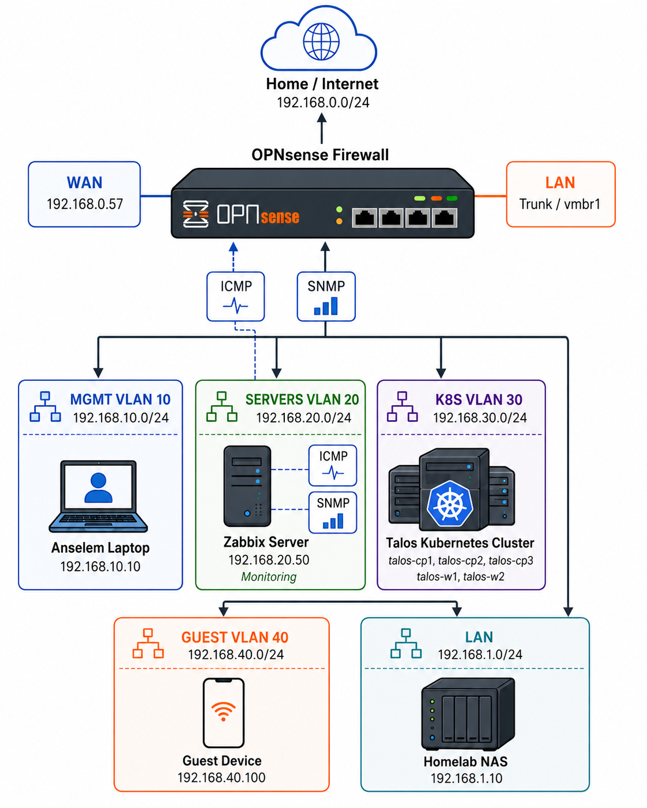

# OPNsense Firewall Monitoring Network Design — Anselem’s Homelab

.gif)



## Purpose

This document explains the personalized OPNsense firewall monitoring design used in my homelab.

The design shows how my homelab network is segmented, where the Zabbix monitoring server lives, how my laptop connects as the admin workstation, and how the Talos Kubernetes cluster and NAS fit into the overall infrastructure.

The goal is not only to make the lab work, but to build it like a small enterprise environment with clear network separation, stable infrastructure IPs, controlled firewall rules, and observable network services.

---

## Final Homelab Design Summary

```text
                         Home / Internet
                         192.168.0.0/24
                                |
                              WAN
                         192.168.0.57
                                |
                         OPNsense Firewall
                                |
                       LAN Trunk / vmbr1
                                |
      ---------------------------------------------------------
      |                 |                  |                 |
  MGMT VLAN 10     SERVERS VLAN 20     K8S VLAN 30      GUEST VLAN 40
192.168.10.0/24   192.168.20.0/24    192.168.30.0/24  192.168.40.0/24
      |                 |                  |                 |
Anselem Laptop     Zabbix Server       Talos K8s Cluster   Guest Device
192.168.10.10      192.168.20.50       talos-cp/w nodes    192.168.40.100

                         LAN
                    192.168.1.0/24
                         |
                    Homelab NAS
                    192.168.1.10
```

The key design decision:

> Zabbix monitors OPNsense from the SERVERS VLAN, while my laptop stays in the MGMT VLAN for administration.

This keeps monitoring, administration, Kubernetes workloads, guest devices, and storage separated by function.

---

## Why This Design Fits My Homelab

This topology reflects how I want my homelab to behave:

- My laptop is the trusted admin machine.
- Zabbix is treated as an infrastructure monitoring service.
- The Talos Kubernetes cluster has its own dedicated K8S VLAN.
- Guest devices are isolated from infrastructure systems.
- The NAS sits on the internal LAN as shared storage.
- OPNsense becomes the central control point for routing, firewalling, and monitoring access.

This makes the lab useful for real DevOps, SRE, platform engineering, and infrastructure security practice.

---

## Network and VLAN Layout

| Network | Subnet | Main Device / Role | Purpose |
|---|---:|---|---|
| WAN | `192.168.0.0/24` | OPNsense WAN `192.168.0.57` | Upstream home/internet network |
| MGMT VLAN 10 | `192.168.10.0/24` | Anselem Laptop `192.168.10.10` | Admin and management access |
| SERVERS VLAN 20 | `192.168.20.0/24` | Zabbix Server `192.168.20.50` | Monitoring and infrastructure services |
| K8S VLAN 30 | `192.168.30.0/24` | Talos Kubernetes cluster | Kubernetes platform and workloads |
| GUEST VLAN 40 | `192.168.40.0/24` | Guest Device `192.168.40.100` | Isolated guest access |
| LAN | `192.168.1.0/24` | Homelab NAS `192.168.1.10` | Internal storage / NAS network |

The enterprise idea is simple:

```text
Do not place everything in one flat network.
Separate systems by trust level and function.
Use firewall rules to control communication between zones.
```

---

## OPNsense Firewall Role

OPNsense is the core of the homelab network.

It provides:

- routing between VLANs
- firewall control between networks
- WAN access to the upstream home network
- controlled access to monitoring services
- ICMP and SNMP visibility for Zabbix
- a realistic firewall platform for enterprise-style practice

In this design, OPNsense is not just a router. It is the security and observability control point for the homelab.

---

## MGMT VLAN 10 — My Laptop

The MGMT VLAN is for trusted administration.

```text
MGMT VLAN 10
Subnet: 192.168.10.0/24
Device: Anselem Laptop
IP: 192.168.10.10
```

My laptop remains in this network because it represents the administrator workstation.

From here, I can manage:

- OPNsense
- Zabbix
- Proxmox
- Kubernetes jumpbox or admin tools
- NAS administration
- other homelab services

The reason for keeping my laptop in MGMT is security and clarity.

```text
Admin access should come from a trusted management network,
not from client, guest, or workload networks.
```

---

## SERVERS VLAN 20 — Zabbix Monitoring Server

The SERVERS VLAN contains infrastructure services.

```text
SERVERS VLAN 20
Subnet: 192.168.20.0/24
Zabbix Server: 192.168.20.50
```

Zabbix stays in the SERVERS network because it is a monitoring system, not a user device.

It monitors OPNsense using:

- ICMP for reachability
- SNMP for firewall/interface metrics

This gives Zabbix a clean and predictable path to the firewall without placing it on the WAN or guest side.

The important rule is:

```text
Monitoring systems should live in a trusted infrastructure network.
```

---

## K8S VLAN 30 — Talos Kubernetes Cluster

The CLIENTS network in the earlier design is personalized here as my Kubernetes network.

```text
K8S VLAN 30
Subnet: 192.168.30.0/24
Cluster: Talos Kubernetes Cluster
Nodes:
  talos-cp1
  talos-cp2
  talos-cp3
  talos-w1
  talos-w2
```

This reflects my real homelab focus: Kubernetes platform engineering, observability, security monitoring, and infrastructure automation.

This VLAN is where I can run and test:

- Kubernetes workloads
- platform services
- observability agents
- security tooling
- network policy experiments
- monitoring integrations

Keeping Kubernetes in its own VLAN makes the design cleaner and more realistic.

```text
Kubernetes workloads should be separated from admin and monitoring networks.
```

---

## GUEST VLAN 40 — Guest Devices

Guest devices stay isolated.

```text
GUEST VLAN 40
Subnet: 192.168.40.0/24
Example Device: 192.168.40.100
```

The purpose of this network is to allow internet access without giving access to internal infrastructure.

Guest devices should not freely access:

- Zabbix
- OPNsense management
- Talos Kubernetes nodes
- NAS storage
- Proxmox infrastructure

The firewall policy should be restrictive by default.

```text
Guest network = internet access only, unless explicitly allowed.
```

---

## LAN — Homelab NAS

The LAN network contains the homelab storage system.

```text
LAN
Subnet: 192.168.1.0/24
Homelab NAS: 192.168.1.10
```

The NAS represents shared internal storage.

Depending on the use case, it may serve:

- backups
- ISO storage
- VM templates
- Kubernetes storage experiments
- media or file shares
- infrastructure snapshots

Access to the NAS should be controlled from trusted networks only.

For example:

```text
MGMT VLAN may access NAS administration.
K8S VLAN may access only required storage services.
GUEST VLAN should not access NAS.
```

---

## Proxmox Mental Model

In Proxmox, the OPNsense LAN side is connected to a trunk bridge:

```text
LAN Trunk / vmbr1
```

The bridge acts like a virtual switch carrying VLAN traffic.

The simplified model is:

```text
OPNsense LAN/trunk interface
        |
      vmbr1
        |
  VLAN-backed homelab networks
```

Each VLAN is then separated logically:

```text
VLAN 10 = MGMT
VLAN 20 = SERVERS
VLAN 30 = K8S
VLAN 40 = GUEST
LAN     = 192.168.1.0/24
```

This gives the homelab an enterprise-style network layout even though it runs on virtualized infrastructure.

---

## Why Zabbix Uses a Static IP

The Zabbix server uses:

```text
192.168.20.50
```

This IP should remain static because Zabbix is an infrastructure service.

Static addressing makes it easier to create stable OPNsense firewall rules such as:

```text
Source: 192.168.20.50
Destination: This Firewall
Protocol: ICMP
Purpose: Firewall reachability monitoring
```

And:

```text
Source: 192.168.20.50
Destination: This Firewall
Protocol: UDP
Port: 161
Purpose: SNMP polling
```

If Zabbix used a random DHCP address, monitoring rules could break when the IP changes.

---

## ICMP Monitoring

ICMP answers the basic question:

```text
Is OPNsense reachable from Zabbix?
```

Zabbix sends ping checks from:

```text
Zabbix Server: 192.168.20.50
```

to the OPNsense firewall interface in the SERVERS network.

If ICMP works, it confirms:

- the VLAN path is correct
- Zabbix can reach the firewall
- the firewall rule allows ping
- basic network connectivity is working

---

## SNMP Monitoring

SNMP answers a deeper question:

```text
Can Zabbix collect operational metrics from OPNsense?
```

The flow is:

```text
Zabbix Server
192.168.20.50
    |
    | UDP/161 SNMP request
    |
OPNsense Firewall
    |
SNMP service response
```

SNMP can provide metrics such as:

- firewall uptime
- WAN traffic
- LAN traffic
- interface counters
- interface errors
- device identity
- service availability

This turns OPNsense from a black box into a measurable infrastructure device.

---

## ICMP vs SNMP

| Signal | What it proves |
|---|---|
| ICMP works | OPNsense is reachable |
| SNMP works | OPNsense metrics can be collected |
| ICMP works but SNMP fails | Network path is fine, but SNMP service/rule may be wrong |
| ICMP fails and SNMP fails | Basic connectivity, VLAN, or firewall policy may be broken |

Both checks are useful because they troubleshoot different layers.

---

## Recommended OPNsense Firewall Rules

The monitoring rules should be specific, not open to everyone.

### Allow ICMP from Zabbix

| Field | Value |
|---|---|
| Interface | SERVERS |
| Protocol | ICMP |
| Source | `192.168.20.50` |
| Destination | This Firewall |
| Purpose | Allow Zabbix reachability checks |

### Allow SNMP from Zabbix

| Field | Value |
|---|---|
| Interface | SERVERS |
| Protocol | UDP |
| Source | `192.168.20.50` |
| Destination | This Firewall |
| Port | `161` |
| Purpose | Allow Zabbix SNMP polling |

This follows least privilege:

```text
Only the monitoring server can query firewall telemetry.
```

---

## Suggested Access Policy Between Networks

| Source | Destination | Recommended Access |
|---|---|---|
| MGMT VLAN | OPNsense / Proxmox / Zabbix / NAS | Allow admin access as needed |
| SERVERS VLAN | OPNsense | Allow ICMP and SNMP only |
| K8S VLAN | Internet / required services | Allow only required egress and platform dependencies |
| K8S VLAN | NAS | Allow only required storage ports if needed |
| GUEST VLAN | Internet | Allow |
| GUEST VLAN | MGMT / SERVERS / K8S / NAS | Block |
| LAN / NAS | Internal networks | Allow only required storage/admin flows |

This gives the lab a realistic security posture.

---

## Dashboard Result

The Zabbix dashboard should show firewall monitoring signals such as:

| Widget | Purpose |
|---|---|
| OPNsense ICMP reachability | Confirms firewall is reachable |
| OPNsense SNMP availability | Confirms SNMP polling works |
| OPNsense uptime | Detects reboot or reset |
| WAN traffic in/out | Shows edge traffic |
| Interface traffic | Shows network usage by interface |
| Interface errors | Detects network quality issues |

This gives a clear enterprise-style firewall monitoring view.

---

## Enterprise Concepts Demonstrated

This homelab design demonstrates several real infrastructure principles.

### 1. Network Segmentation

Different systems are placed into different networks:

```text
MGMT
SERVERS
K8S
GUEST
LAN
WAN
```

This reduces blast radius and improves control.

### 2. Trusted Monitoring Network

Zabbix lives in the SERVERS VLAN, not in the guest or workload network.

This makes it part of the trusted infrastructure layer.

### 3. Dedicated Management Network

My laptop lives in the MGMT VLAN so administration is separated from workloads and guest devices.

### 4. Kubernetes Isolation

The Talos Kubernetes cluster has its own VLAN, making it easier to control traffic and test realistic platform engineering scenarios.

### 5. Least Privilege Firewalling

Only required monitoring traffic is allowed:

```text
ICMP from Zabbix to OPNsense
SNMP UDP/161 from Zabbix to OPNsense
```

### 6. Stable Infrastructure IPs

Zabbix and key infrastructure systems use predictable addresses.

This keeps firewall rules, monitoring targets, and documentation stable.

### 7. Troubleshooting by Layer

When something fails, troubleshoot in order:

```text
1. Is the VM or device powered on?
2. Is the interface connected?
3. Is the IP address correct?
4. Is the VLAN tag correct?
5. Is the Proxmox bridge correct?
6. Does ping work?
7. Does the OPNsense firewall allow the traffic?
8. Does SNMP respond?
9. Does Zabbix collect data?
10. Does the dashboard show the expected result?
```

---

## Final Working State

```text
OPNsense:
  WAN = 192.168.0.57
  LAN/trunk = vmbr1
  Provides routing and firewall control for homelab VLANs

Anselem Laptop:
  Network = MGMT VLAN 10
  IP = 192.168.10.10
  Purpose = trusted admin workstation

Zabbix Server:
  Network = SERVERS VLAN 20
  IP = 192.168.20.50
  Purpose = infrastructure monitoring

Talos Kubernetes Cluster:
  Network = K8S VLAN 30
  Nodes = talos-cp1, talos-cp2, talos-cp3, talos-w1, talos-w2
  Purpose = Kubernetes platform engineering lab

Guest Device:
  Network = GUEST VLAN 40
  IP = 192.168.40.100
  Purpose = isolated guest network testing

Homelab NAS:
  Network = LAN
  IP = 192.168.1.10
  Purpose = internal storage
```

---

## Key Lesson

The most important lesson from this design is:

> A good homelab is not just a group of VMs. It is a controlled infrastructure environment where networks, firewall rules, monitoring, storage, and Kubernetes workloads are designed intentionally.

In this setup, OPNsense provides the network control plane, Zabbix provides infrastructure visibility, my laptop acts as the trusted admin workstation, and the Talos Kubernetes cluster becomes the platform engineering environment.

That makes the homelab more than a lab.

It becomes a small enterprise-style infrastructure platform for learning, testing, documenting, and demonstrating real DevOps/SRE capability.
